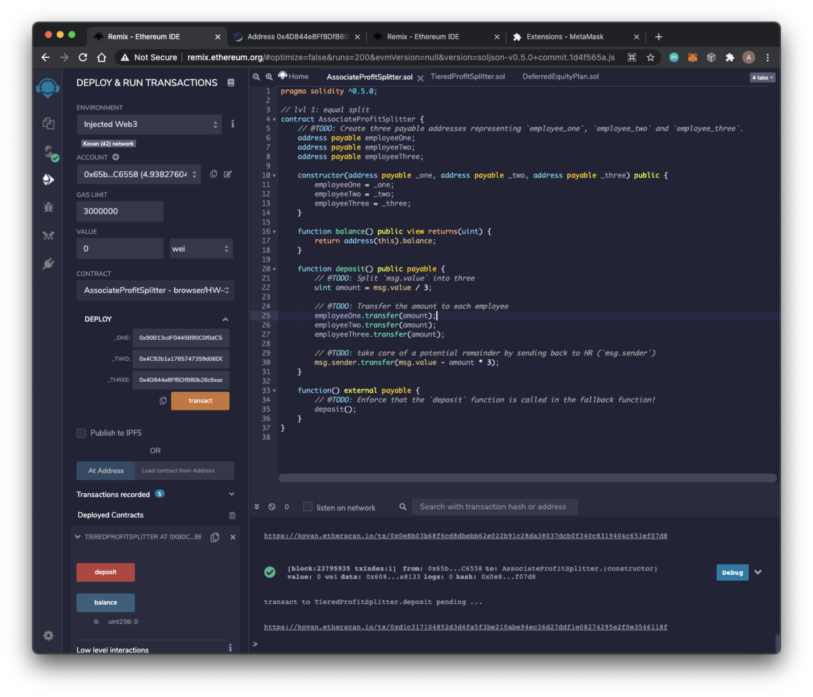
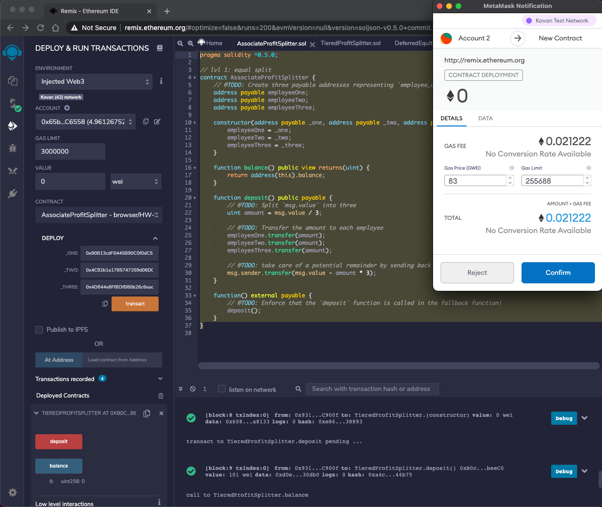
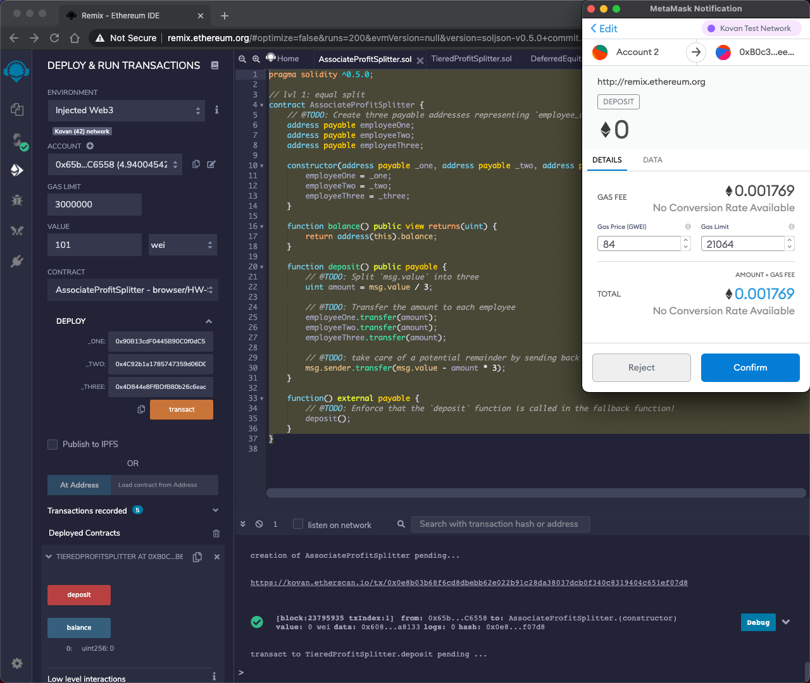

# Smart Contracts

## Overview
Utilize smart contract to automate company finances for transparency and accounting purposes.

------
## Software Required

1. [Remix](https://remix.ethereum.org/#optimize=false&runs=200&evmVersion=null&version=soljson-v0.7.4+commit.3f05b770.js) - Webapp

2. [Metamask](chrome://extensions/?id=nkbihfbeogaeaoehlefnkodbefgpgknn) - Google Chrome plugin

3. ETH wallet with test ETH on Kovan or Rospten test network.

----
## Steps to Transact

1.  Import the .sol file into Remix

2. Compile the file you want.

3. Deploy the file by adding the employeee wallet addresses to the deplloy dropdown. Make sure you deploy with zero value.

4. Add the total payroll to the value field and hit the red deposit button.

5. Confirm on metamask

6. Wait for confirmation

7. Repeat the steps for the different contracts!

------
## Sources
* Header Image - https://www.cleveroad.com/blog/smart-contracts-blockchain-changes-the-way-how-to-do-your-business

* Trilogy Fintech Bootcamp at Rice University

------
## Contributors

* Asif Meghani [LinkedIn](www.linkedin.com/in/asif-meghani-26a2a719)

-----

## License
MIT License

----